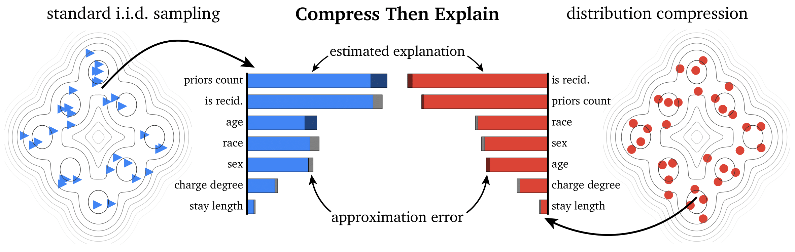

# Efficient and Accurate Explanation Estimation with Distribution Compression

This repository is a supplement to the following paper:

> Hubert Baniecki, Giuseppe Casalicchio, Bernd Bischl, Przemyslaw Biecek. *Efficient and Accurate Explanation Estimation with Distribution Compression*. **ICML 2024 Workshop on DMLR**

### Start: examples

In `examples`, we provide 4 Jupyter notebooks with simple code examples on how to use CTE with SHAP, SAGE, Expected Gradients, and Feature Effects.

### Advanced: experiments

In `experiments`, we provide code to reproduce the results reported in Section 4 of the paper.

### Acknowledgements

This work was financially supported by the Polish National Science Centre grant number 2021/43/O/ST6/00347. Hubert Baniecki gratefully acknowledges scholarship funding from the Polish National Agency for Academic Exchange under the Preludium Bis NAWA 3 programme.

