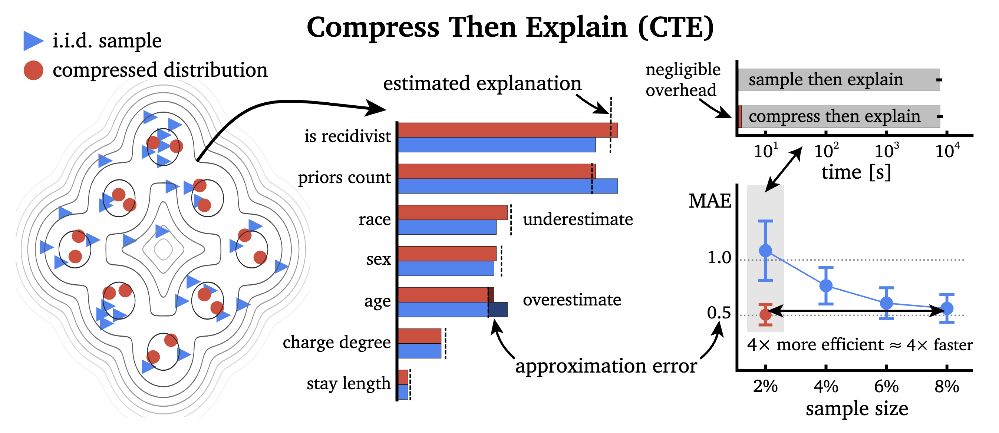

# Efficient and accurate explanation estimation with distribution compression

This repository is a supplement to [the following paper](https://arxiv.org/abs/2406.18334):

> Hubert Baniecki, Giuseppe Casalicchio, Bernd Bischl, Przemyslaw Biecek. *Efficient and Accurate Explanation Estimation with Distribution Compression*. **ICLR 2025** https://arxiv.org/abs/2406.18334



### Start: examples

In `examples`, we provide 4 Jupyter notebooks with simple code examples on how to use CTE to improve the estimation of SHAP, SAGE, Expected Gradients, and Feature Effects.

### Details: experiments

In `experiments`, we provide code to reproduce the results reported in Section 4 of the paper.

### Citation

```bibtex
@inproceedings{baniecki2025efficient,
    title     = {Efficient and Accurate Explanation Estimation with Distribution Compression},
    author    = {Hubert Baniecki and 
                 Giuseppe Casalicchio and 
                 Bernd Bischl and 
                 Przemyslaw Biecek},
    booktitle = {International Conference on Learning Representations},
    year      = {2025},
    url       = {https://openreview.net/forum?id=LiUfN9h0Lx}
}
```

### Acknowledgements

This work was financially supported by the Polish National Science Centre grant number 2021/43/O/ST6/00347. Hubert Baniecki gratefully acknowledges scholarship funding from the Polish National Agency for Academic Exchange under the Preludium Bis NAWA 3 programme.

